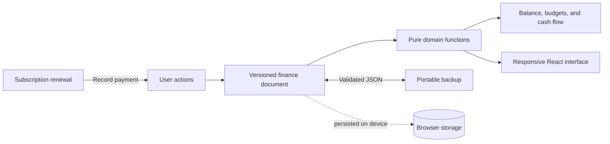

<p align="center">
  <a href="https://tally.ethankpham.workers.dev">
    
  </a>
</p>

<h1 align="center">Tally</h1>

<p align="center">
  A local-first personal finance tracker for cash flow, budgets, and recurring subscriptions.<br>
  Private by design, responsive by default, and available in English and Vietnamese.
</p>

<p align="center">
  <a href="https://github.com/ethankpham03-ui/tally/actions/workflows/ci.yml"></a>
  <a href="https://tally.ethankpham.workers.dev"></a>
</p>

<p align="center">
  <a href="https://tally.ethankpham.workers.dev"><strong>Live demo</strong></a>
  ·
  <a href="#why-tally">Why Tally</a>
  ·
  <a href="#run-locally">Run locally</a>
  ·
  <a href="./PRODUCT.md">Product brief</a>
  ·
  <a href="./DESIGN.md">Design system</a>
</p>


> New users start with a short welcome and their own opening balances, with no sample financial records. Tally has no sign-in account, backend, analytics, or cloud sync; your finance data stays in your browser. Financial accounts are records you manage locally, not connections to your bank. The hosted site changes only when this implementation is deployed.

## Why Tally

Most expense trackers treat recurring subscriptions as a separate list. Tally connects them to the same ledger that powers balance, spending, budgets, and cash-flow trends. A renewal becomes an expense only when the user explicitly records the payment, so forecasts never silently rewrite financial history.

| Product capability | Engineering detail |
| --- | --- |
| Money across accounts | Cash, bank accounts, e-wallets, and credit cards share one ledger, with separate cash, debt, and net-worth totals. |
| Spending and money movement | Internal transfers, card repayments, refunds, and fees follow distinct reporting rules. |
| Multiple currencies | Ten account currencies, exact minor-unit amounts, manual dated FX, and preserved historical VND conversions. |
| Subscription-aware cash flow | Renewals support pause/resume, overdue states, month-end dates, leap years, and idempotent payment recording. |
| Local-first ownership | Versioned browser persistence, validated JSON import/export, remembered onboarding, and safe destructive actions. |
| Portfolio-grade experience | Complete EN/VI copy, light and dark themes, keyboard-visible focus, responsive navigation, and 320px+ layouts. |

## What works

- Set up cash, bank, wallet, and credit-card opening balances in a short onboarding flow, import an existing backup, or start with zero cash and set up later.
- Add, edit, search, filter, and remove transactions with Undo.
- Manage money sources, inspect account histories, reconcile balances, and archive accounts while preserving history.
- Transfer between accounts, including different currencies, with a separately recorded fee.
- Track credit-card debt, credit balances, limits, statements, and partial repayments without counting purchases twice.
- Record refunds against spending categories and use the actual account debit for foreign subscription payments.
- Keep native amounts in VND, USD, EUR, GBP, JPY, KRW, SGD, THB, AUD, or CAD; consolidated reports use VND and disclose missing conversions.
- Track category budgets derived from real expense transactions.
- Add, edit, pause, and remove recurring subscriptions.
- Pick from a traceable subscription catalog or enter a custom service and price.
- Record each renewal once and advance its next billing date safely.
- Explore income/spending and movements of available money across 7 days, 30 days, 6 months, or 1 year.
- Export or import a validated personal backup, or reset local data with confirmation to start onboarding again.
- Switch the complete interface between English and Vietnamese, light and dark, desktop and mobile.

## Architecture



The domain layer owns money calculations, date-only arithmetic, recurrence, validation, migration, and payment idempotency. The React surface consumes those results and persists one versioned document locally, keeping financial rules testable without a browser.

V4 uses a separate storage key, preserves the original legacy document, and writes an exact legacy backup before the first migrated save. Commits check revisions and observed payloads under Web Locks when available; browsers without Web Locks use best-effort conflict checks. Corrupt or newer stored data blocks writes. See the [V4 implementation and verification notes (Vietnamese)](./docs/multi-account-implementation.vi.md) for the financial rules, migration behavior, and release checklist. These notes describe the repository implementation, independently of when a hosted release is published.

The optional onboarding marker is backward compatible with saved V4 documents. Returning personal ledgers are preserved and do not repeat setup. An untouched ledger explicitly marked as demo is replaced with a blank personal ledger through the same guarded storage controller. Once a user has edited a demo ledger it is personal data, so it is never automatically cleared. A failed cleanup offers retry and original-document export rather than displaying sample balances.

## Stack

- **Application:** React 19, TypeScript, Vinext, and Vite
- **Interface:** CSS design tokens, Motion, Phosphor Icons, local CookieRun headings, and PF Beau Sans body text, controls, and financial numerals
- **Quality:** ESLint, strict TypeScript, and Node's built-in test runner
- **Delivery:** Native Vinext deployment to Cloudflare Workers

Fonts are served as local WOFF2 files. CookieRun Bold gives main titles a friendly, rounded character, while CookieRun Regular supports smaller headings and PF Beau Sans keeps the working interface calm. PF Beau Sans Book and CookieRun Bold are preloaded; other cuts load as needed. Body text uses Book 500, quieter emphasis uses SemiBold 600, and controls, labels, and dominant values use Bold 700. The enlarged type scale adds 15–17% to sizes; weights use real static cuts with synthetic bold and italic disabled. PF Beau Sans provides tabular digits by default and supports OpenType `tnum`. See [Typography in the design system](./DESIGN.md#typography) for sizes, weights, and font roles.

## Run locally

Requirements: Node.js 22.13 or newer and npm.

```bash
git clone https://github.com/ethankpham03-ui/tally.git
cd tally
npm ci
npm run dev
```

Open the local URL printed by Vinext.

## Quality checks

```bash
npm run typecheck
npm run lint
npm test
npm run build
```

The test suite covers ledger totals, account setup, transfers and fees, card repayments and refunds, statements, historical FX, integer overflow, date-only arithmetic, recurrence, validated migration, storage conflicts, subscription catalog integrity, and idempotent renewal payments. The same checks run automatically for every pull request and push to `main`.

## Deploy

```bash
npm run deploy
```

Authenticate once with `wrangler login`. The deploy command is intentionally pinned to the Cloudflare account and `tally` Worker in `wrangler.jsonc`, which publishes to `tally.ethankpham.workers.dev`.

## Privacy and limitations

Tally is intentionally device-local. Clearing site data can remove financial data, and data does not sync between devices, so JSON export is the explicit backup path. Bank connections, automatic exchange rates, and automatic interest calculations are not included. Tally is a portfolio project and not financial advice. Read the full [privacy notes](./PRIVACY.md), including how legacy migration copies are retained.

## Contributing and security

Focused issue reports are welcome. Because the repository is currently unlicensed, please discuss code contributions in an issue before opening a pull request. Read [CONTRIBUTING.md](./CONTRIBUTING.md) for the project constraints, and use the private process in [SECURITY.md](./SECURITY.md) for vulnerabilities.

Service names and marks are used only to identify subscriptions in the demo. See [NOTICE.md](./NOTICE.md) for attribution and pricing-source details.

## License

No open-source license has been granted yet. The source is public for portfolio review; please open an issue before reusing it.
