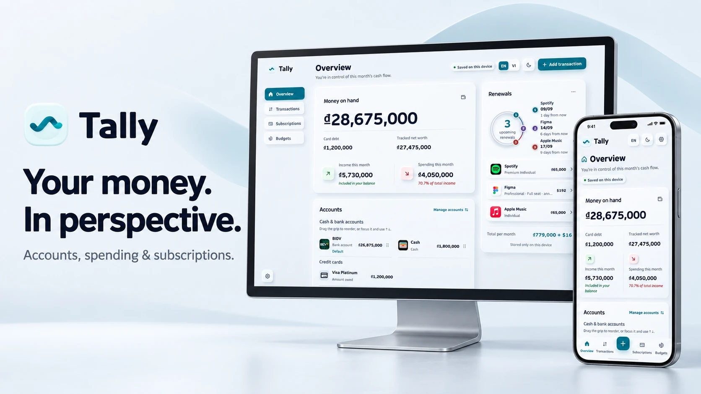
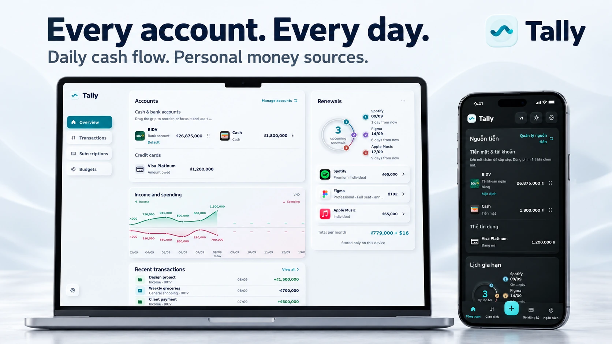
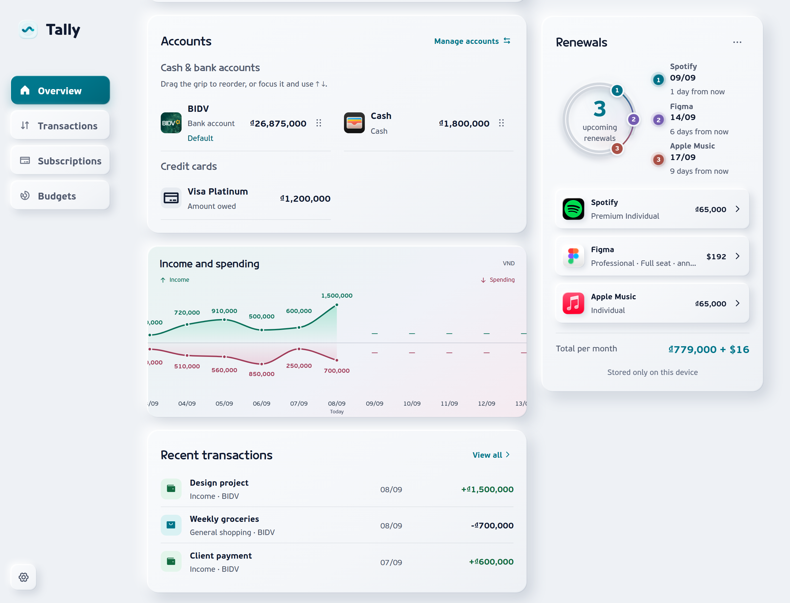
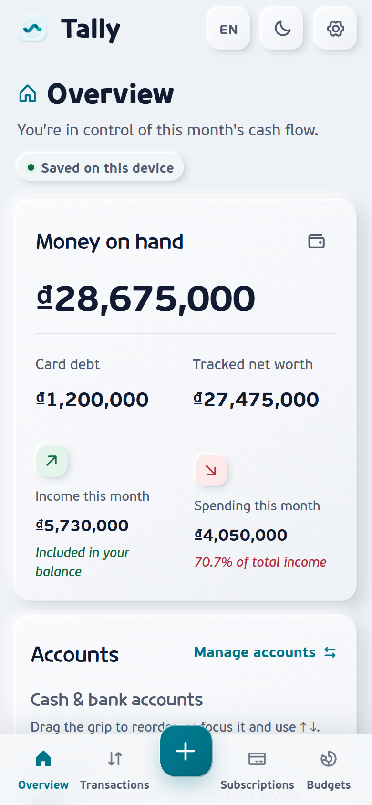
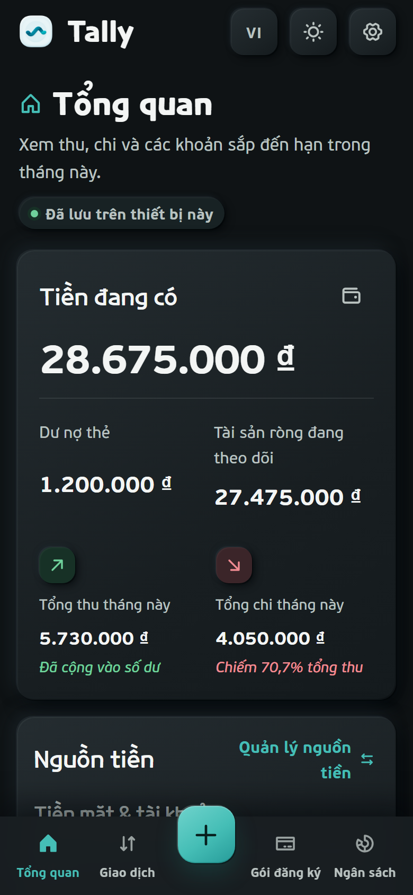
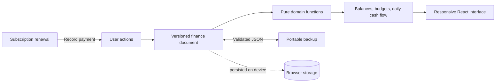

<p align="center">
  <a href="https://tally.ethankpham.workers.dev">
    
  </a>
</p>

<h1 align="center">Tally</h1>

<p align="center">
  <strong>A clearer picture of your everyday money.</strong><br>
  Accounts, spending, budgets, and subscriptions in one personal ledger.<br>
  Stored on your device. Available in English and Vietnamese.
</p>

<p align="center">
  <a href="https://github.com/ethankpham03-ui/tally/actions/workflows/ci.yml"></a>
  
  
  
</p>

<p align="center">
  <a href="https://tally.ethankpham.workers.dev"><strong>Try Tally ↗</strong></a>
  · <a href="#latest-improvements">What's new</a>
  · <a href="#screenshots">Screenshots</a>
  · <a href="#run-locally">Run locally</a>
  · <a href="./README.vi.md">Tiếng Việt</a>
</p>

## Why Tally

Know what you have, what you owe, and what is coming due. Tally brings cash, bank accounts, wallets, credit cards, and recurring subscriptions into the same ledger, so your balances and spending tell a consistent story.

A subscription renewal becomes an expense when you **record the payment**. A card repayment moves money without counting the purchase twice. Transfers, fees, and refunds each follow their own reporting rules.

**No sign-up required.** Start with your own opening balances, import a backup, or begin with zero cash. New installations contain no sample financial records. The visuals below use illustrative data.

## Latest improvements

- **See your days in context.** Two distinct income and spending waves cover 31 days centered on today. Scroll through dates and inspect exact daily amounts, with missing conversions clearly marked.
- **Catch up on your ledger.** Transactions are grouped by day with income and spending totals. Record past or future entries, type dates as `dd/mm/yyyy`, and enter amounts with automatic thousands separators.
- **Arrange your money your way.** Reorder sources using touch, mouse, or keyboard and save a default source for new transactions. Bundled banking app artwork helps distinguish accounts from Vietnam, the US, and the UK.
- **A more considered interface.** Refined typography, sculpted panels, synchronized theme colors, and layouts that adapt from a 320px mobile viewport to a full desktop dashboard.

The chart shows recorded entries, including future entries you add yourself. It does not predict spending or automatically record upcoming renewals.

## What you can do

| Capability | In everyday use |
| --- | --- |
| **Manage every money source** | Track cash, banks, wallets, and credit cards; separate available money, debt, card credit, and net worth. Review histories, reconcile balances, and archive unused sources. |
| **Move money accurately** | Transfer within or across currencies, record fees separately, handle refunds, and track card statements and partial repayments. |
| **Keep native currencies** | Use VND, USD, EUR, GBP, JPY, KRW, SGD, THB, AUD, or CAD. Consolidated financial reports use VND, with manual dated FX and preserved historical conversions. |
| **Keep subscriptions visible** | Choose a source-linked catalog entry or a custom service. Track monthly/yearly billing, pause or resume, review upcoming/overdue renewals, and record each payment once. |
| **Stay close to your spending** | Search and filter transactions, manage categories, follow category budgets calculated from recorded expenses, and undo deletions. |
| **Keep control of your data** | Export and restore validated JSON backups. Use the complete interface in English or Vietnamese, with light and dark themes on desktop and mobile web. |

<p align="center">
  
</p>

## Screenshots

Actual app captures with synthetic financial records. The promotional banners are AI-rendered device compositions based on these captures; the original screenshots below show the exact interface.

<p align="center">
  <a href="./docs/images/screenshots/desktop-cashflow.png">
    
  </a>
</p>

<p align="center">
  <a href="./docs/images/screenshots/mobile-overview.png"></a>
  &nbsp;
  <a href="./docs/images/screenshots/mobile-dark.png"></a>
</p>

Find the banners, original captures, and creative prompts in the [media kit](./docs/media-kit.md).

## Run locally

Requires **Node.js 22.13 or newer** and npm.

```bash
git clone https://github.com/ethankpham03-ui/tally.git
cd tally
npm ci
npm run dev
```

Open the local URL printed by Vinext. There is no finance backend database, API key, or sign-in account to configure for local use.

## Architecture



The ledger is the source of truth. Pure domain functions handle exact minor-unit money, date-only arithmetic, transfers, recurrence, migration, and duplicate-payment prevention. React renders the results; a guarded storage controller persists the versioned document locally.

V4 preserves the legacy document and an exact pre-migration backup. Revision checks and Web Locks, where available, help prevent conflicting writes across tabs; unsupported browsers use best-effort checks. Corrupt or newer stored data blocks writes. See the [V4 implementation notes](./docs/multi-account-implementation.vi.md) for the detailed financial and storage rules.

| Layer | Tools |
| --- | --- |
| Application | React 19, TypeScript, Vinext, Vite |
| Interface | CSS design tokens, Motion, Phosphor Icons |
| Typography | Locally served CookieRun headings and PF Beau Sans interface text |
| Verification | ESLint, strict TypeScript, Node's built-in test runner |
| Hosting | Cloudflare Workers through native Vinext deployment |

## Quality checks

```bash
npm run check
```

Runs type checking, lint, domain tests, and the production build. Individual commands are available when iterating:

```bash
npm run typecheck
npm run lint
npm test
npm run build
```

Tests cover account balances, transfers and fees, repayments, refunds, statements, historical FX, date handling, daily cash flow, recurrence, onboarding, migration, storage conflicts, and catalog integrity. [GitHub Actions](./.github/workflows/ci.yml) also audits production dependencies and validates a Cloudflare deployment dry run.

## Deploy

The checked-in [Wrangler configuration](./wrangler.jsonc) targets the existing Tally Cloudflare account and Worker. For your own deployment, configure your Cloudflare account and Worker name in `wrangler.jsonc` and the `deploy` script in `package.json` first.

```bash
npx wrangler login
npm run deploy
```

The linked demo is the deployed release; this README describes the current repository implementation.

## Privacy and limitations

Financial records stay in the browser where you enter them. Tally has no sign-in system, finance backend database, analytics SDK, bank connections, or cloud sync. The desktop and mobile experiences do not automatically share data; JSON export/import is the manual backup and transfer path.

Clearing browser site data can erase your ledger. Exchange rates are entered manually; automatic payments, interest calculations, and live catalog pricing are not included. Read [PRIVACY.md](./PRIVACY.md) for storage, recovery copies, and deletion behavior.

## Project documentation

| Document | Contents |
| --- | --- |
| [Product brief](./PRODUCT.md) | Audience, product behavior, and scope |
| [Design system](./DESIGN.md) | Color, typography, components, and responsive rules |
| [Account updates](./docs/account-updates.vi.md) | Ordering, defaults, and bank artwork |
| [Financial implementation](./docs/multi-account-implementation.vi.md) | Ledger rules, currencies, migration, and verification |
| [Media kit](./docs/media-kit.md) | Promotional banners, screenshots, and asset provenance |
| [Contributing](./CONTRIBUTING.md) · [Security](./SECURITY.md) | Collaboration guidelines and private vulnerability reporting |

## Contributing and security

Focused issue reports are welcome. Please discuss code contributions with the maintainer before opening a pull request, as described in [CONTRIBUTING.md](./CONTRIBUTING.md). Report vulnerabilities through the private process in [SECURITY.md](./SECURITY.md).

## License

The source is public for portfolio review and is currently **unlicensed**; no open-source reuse license has been granted. Please open an issue before reusing it. Third-party service names and artwork identify services and financial accounts, without implying affiliation or endorsement. See [NOTICE.md](./NOTICE.md) and the [bank artwork sources](./docs/bank-icon-sources.md).
