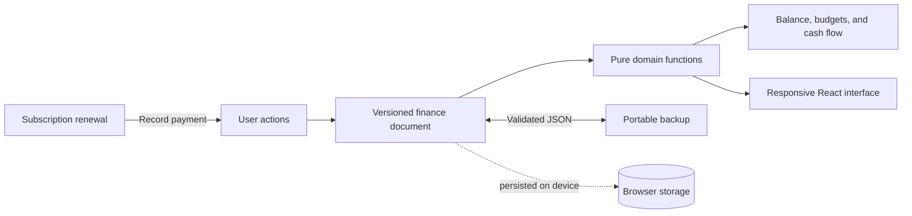

<p align="center">
  <a href="https://tally-finance.cheapdreams02.chatgpt.site">
    
  </a>
</p>

<h1 align="center">Tally</h1>

<p align="center">
  A local-first personal finance tracker for cash flow, budgets, and recurring subscriptions.<br>
  Private by design, responsive by default, and available in English and Vietnamese.
</p>

<p align="center">
  <a href="https://github.com/ethankpham03-ui/tally/actions/workflows/ci.yml"></a>
  <a href="https://tally-finance.cheapdreams02.chatgpt.site"></a>
</p>

<p align="center">
  <a href="https://tally-finance.cheapdreams02.chatgpt.site"><strong>Live demo</strong></a>
  ·
  <a href="#why-tally">Why Tally</a>
  ·
  <a href="#run-locally">Run locally</a>
  ·
  <a href="./PRODUCT.md">Product brief</a>
  ·
  <a href="./DESIGN.md">Design system</a>
</p>


> The demo uses date-aware sample data. Tally has no account, backend, analytics, or cloud sync; your finance data stays in your browser.

## Why Tally

Most expense trackers treat recurring subscriptions as a separate list. Tally connects them to the same ledger that powers balance, spending, budgets, and cash-flow trends. A renewal becomes an expense only when the user explicitly records the payment, so forecasts never silently rewrite financial history.

| Product capability | Engineering detail |
| --- | --- |
| One coherent financial picture | A single transaction ledger is the source of truth for balance, monthly totals, budgets, and charts. |
| Subscription-aware cash flow | Renewals support pause/resume, overdue states, month-end dates, leap years, and idempotent payment recording. |
| Local-first ownership | Versioned browser persistence, validated JSON import/export, sample-data restore, and safe destructive actions. |
| Portfolio-grade experience | Complete EN/VI copy, light and dark themes, keyboard-visible focus, responsive navigation, and 320px+ layouts. |

## What works

- Add, edit, search, filter, and remove transactions with Undo.
- Track category budgets derived from real expense transactions.
- Add, edit, pause, and remove recurring subscriptions.
- Pick from a traceable subscription catalog or enter a custom service and price.
- Record each renewal once and advance its next billing date safely.
- Explore cash flow across 7 days, 30 days, 6 months, or 1 year.
- Export or import a validated backup, restore sample data, or clear local data with confirmation.
- Switch the complete interface between English and Vietnamese, light and dark, desktop and mobile.

## Architecture



The domain layer owns money calculations, date-only arithmetic, recurrence, validation, migration, and payment idempotency. The React surface consumes those results and persists one versioned document locally, keeping financial rules testable without a browser.

## Stack

- **Application:** React 19, TypeScript, Vinext, and Vite
- **Interface:** CSS design tokens, Motion, Phosphor Icons, and bundled Be Vietnam Pro typography
- **Quality:** ESLint, strict TypeScript, and Node's built-in test runner
- **Delivery:** Cloudflare-compatible output deployed through OpenAI Sites

## Run locally

Requirements: Node.js 22.13 or newer and npm.

```bash
git clone https://github.com/ethankpham03-ui/tally.git
cd tally
npm ci
npm run dev
```

Open the local URL printed by Vinext.

## Quality checks

```bash
npm run typecheck
npm run lint
npm test
npm run build
```

The test suite covers ledger totals, month scoping, budgets, date-only arithmetic, recurrence, persistence migration and validation, subscription catalog integrity, and idempotent renewal payments. The same checks run automatically for every pull request and push to `main`.

## Privacy and limitations

Tally is intentionally device-local. Clearing site data can remove the finance document, and data does not sync between devices, so JSON export is the explicit backup path. Tally is a portfolio project and not financial advice. Read the full [privacy notes](./PRIVACY.md).

## Contributing and security

Focused issue reports are welcome. Because the repository is currently unlicensed, please discuss code contributions in an issue before opening a pull request. Read [CONTRIBUTING.md](./CONTRIBUTING.md) for the project constraints, and use the private process in [SECURITY.md](./SECURITY.md) for vulnerabilities.

Service names and marks are used only to identify subscriptions in the demo. See [NOTICE.md](./NOTICE.md) for attribution and pricing-source details.

## License

No open-source license has been granted yet. The source is public for portfolio review; please open an issue before reusing it.
