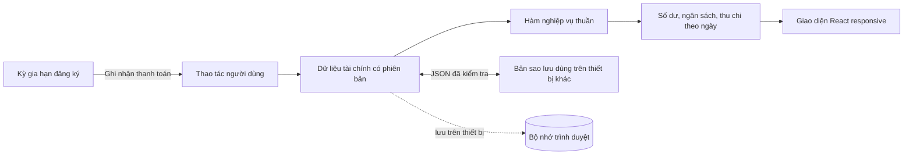

<p align="center">
  <a href="https://tally.ethankpham.workers.dev">
    
  </a>
</p>

<h1 align="center">Tally</h1>

<p align="center">
  <strong>Nhìn rõ tiền của bạn, mỗi ngày.</strong><br>
  Nguồn tiền, thu chi, ngân sách và gói đăng ký trong cùng một sổ tài chính cá nhân.<br>
  Dữ liệu lưu trên thiết bị. Hỗ trợ tiếng Việt và tiếng Anh.
</p>

<p align="center">
  <a href="https://github.com/ethankpham03-ui/tally/actions/workflows/ci.yml"></a>
  
  
  
</p>

<p align="center">
  <a href="https://tally.ethankpham.workers.dev"><strong>Trải nghiệm Tally ↗</strong></a>
  · <a href="#latest-improvements">Cập nhật mới</a>
  · <a href="#screenshots">Ảnh giao diện</a>
  · <a href="#run-locally">Chạy trên máy</a>
  · <a href="./README.md">English</a>
</p>

## Vì sao chọn Tally

Biết tiền đang ở đâu, đang nợ bao nhiêu và khoản nào sắp đến hạn. Tally kết nối tiền mặt, tài khoản ngân hàng, ví điện tử, thẻ tín dụng và các gói đăng ký trong cùng một sổ, để số dư và thu chi luôn nhất quán.

Một kỳ gia hạn chỉ trở thành khoản chi khi bạn **ghi nhận thanh toán**. Trả nợ thẻ là chuyển tiền, nên khoản mua trước đó không bị tính chi tiêu lần hai. Chuyển tiền, phí và hoàn tiền đều có quy tắc báo cáo riêng.

**Không cần đăng ký tài khoản.** Nhập số dư ban đầu của bạn, khôi phục bản sao lưu hoặc bắt đầu với tiền mặt 0 ₫. Lần sử dụng đầu tiên không có dữ liệu tài chính mẫu. Các hình bên dưới sử dụng dữ liệu minh họa.

<a id="latest-improvements"></a>

## Những cải tiến mới nhất

- **Theo dõi thu chi trong từng ngày.** Hai đường sóng riêng cho thu nhập và chi tiêu trải dài 31 ngày, với hôm nay ở giữa. Cuộn ngang để xem từng ngày, đọc số tiền chính xác và nhận biết các khoản chưa đủ tỷ giá quy đổi.
- **Ghi chép đầy đủ, nhập liệu thuận tay.** Giao dịch được nhóm theo ngày với tổng thu và tổng chi. Bổ sung khoản đã phát sinh hoặc ghi trước giao dịch tương lai, nhập ngày theo dạng `dd/mm/yyyy` và nhập tiền với dấu phân cách hàng nghìn tự động.
- **Sắp xếp nguồn tiền theo thói quen của bạn.** Đổi thứ tự bằng cảm ứng, chuột hoặc bàn phím; lưu nguồn mặc định cho giao dịch mới. Bộ icon ứng dụng ngân hàng từ Việt Nam, Mỹ và Anh được lưu cùng ứng dụng để dễ nhận diện từng nguồn.
- **Giao diện được chăm chút hơn.** Kiểu chữ dễ đọc, các khối giao diện có chiều sâu, màu chủ đề đồng bộ và bố cục thích ứng từ màn hình mobile rộng 320px đến dashboard desktop.

Biểu đồ hiển thị những giao dịch đã được ghi lại, kể cả giao dịch tương lai bạn tự nhập. Biểu đồ không dự đoán chi tiêu hoặc tự ghi nhận các kỳ gia hạn sắp tới.

## Bạn có thể làm gì

| Tính năng | Trong sử dụng hằng ngày |
| --- | --- |
| **Quản lý mọi nguồn tiền** | Theo dõi tiền mặt, ngân hàng, ví và thẻ tín dụng; phân biệt tiền đang có, dư nợ, số dư có trên thẻ và tài sản ròng. Xem lịch sử, đối chiếu số dư và lưu trữ nguồn ngưng sử dụng. |
| **Ghi nhận chuyển tiền chính xác** | Chuyển tiền cùng hoặc khác tiền tệ, ghi phí riêng, xử lý hoàn tiền, theo dõi sao kê thẻ và các lần trả nợ một phần. |
| **Giữ nguyên tiền tệ gốc** | Sử dụng VND, USD, EUR, GBP, JPY, KRW, SGD, THB, AUD hoặc CAD. Báo cáo tài chính tổng hợp dùng VND, với tỷ giá nhập thủ công theo ngày và giá trị quy đổi lịch sử được giữ nguyên. |
| **Không bỏ quên gói đăng ký** | Chọn dịch vụ từ danh mục có liên kết nguồn tham khảo hoặc tự nhập. Theo dõi chu kỳ tháng/năm, tạm dừng hoặc tiếp tục, xem kỳ sắp đến hạn/quá hạn và ghi nhận mỗi lần thanh toán một lần. |
| **Nắm rõ chi tiêu** | Tìm kiếm và lọc giao dịch, quản lý danh mục, theo dõi ngân sách theo danh mục từ các khoản chi đã ghi nhận và hoàn tác thao tác xóa. |
| **Chủ động với dữ liệu của mình** | Xuất và khôi phục bản sao lưu JSON có kiểm tra tính hợp lệ. Sử dụng toàn bộ giao diện bằng tiếng Việt hoặc tiếng Anh, với chế độ sáng và tối trên desktop và mobile web. |

<p align="center">
  
</p>

<a id="screenshots"></a>

## Ảnh giao diện

Ảnh chụp trực tiếp từ ứng dụng với dữ liệu tài chính giả lập. Banner là bố cục quảng bá được AI tạo dựa trên các ảnh chụp này; ảnh gốc bên dưới thể hiện chính xác giao diện ứng dụng.

<p align="center">
  <a href="./docs/images/screenshots/desktop-cashflow.png">
    
  </a>
</p>

<p align="center">
  <a href="./docs/images/screenshots/mobile-overview.png"></a>
  &nbsp;
  <a href="./docs/images/screenshots/mobile-dark.png"></a>
</p>

Xem banner, ảnh chụp gốc và câu lệnh tạo hình trong [bộ tài nguyên truyền thông](./docs/media-kit.md).

<a id="run-locally"></a>

## Chạy trên máy

Cần **Node.js 22.13 trở lên** và npm.

```bash
git clone https://github.com/ethankpham03-ui/tally.git
cd tally
npm ci
npm run dev
```

Mở địa chỉ local mà Vinext hiển thị. Bạn không cần cấu hình cơ sở dữ liệu tài chính phía máy chủ, API key hay tài khoản đăng nhập để chạy ứng dụng trên máy.

## Kiến trúc



Sổ giao dịch là nguồn dữ liệu gốc cho các phép tính. Các hàm nghiệp vụ thuần xử lý tiền chính xác theo đơn vị nhỏ nhất của từng tiền tệ, phép tính ngày, chuyển tiền, chu kỳ gia hạn, chuyển đổi dữ liệu cũ và ngăn ghi nhận thanh toán trùng. React hiển thị kết quả; bộ điều khiển lưu trữ có các bước kiểm tra bảo vệ dữ liệu ghi lại tài liệu có phiên bản ngay trên thiết bị.

V4 giữ tài liệu cũ và một bản sao nguyên vẹn trước khi chuyển đổi. Kiểm tra phiên bản sửa đổi và Web Locks, khi trình duyệt hỗ trợ, giúp ngăn ghi đè xung đột giữa các tab; trình duyệt không hỗ trợ dùng các bước kiểm tra trong khả năng cho phép. Dữ liệu lỗi hoặc thuộc phiên bản mới hơn sẽ chặn thao tác ghi. Xem [ghi chú triển khai V4](./docs/multi-account-implementation.vi.md) để biết chi tiết quy tắc tài chính và lưu trữ.

| Thành phần | Công cụ |
| --- | --- |
| Ứng dụng | React 19, TypeScript, Vinext, Vite |
| Giao diện | CSS design tokens, Motion, Phosphor Icons |
| Kiểu chữ | CookieRun cho tiêu đề và PF Beau Sans cho nội dung giao diện, phục vụ từ file cục bộ |
| Kiểm tra | ESLint, TypeScript ở chế độ strict, trình chạy kiểm thử tích hợp của Node |
| Hosting | Cloudflare Workers qua cơ chế triển khai gốc của Vinext |

## Kiểm tra chất lượng

```bash
npm run check
```

Chạy kiểm tra kiểu dữ liệu, lint, kiểm thử nghiệp vụ và build bản production. Có thể chạy riêng từng bước trong quá trình phát triển:

```bash
npm run typecheck
npm run lint
npm test
npm run build
```

Bộ kiểm thử bao phủ số dư nguồn tiền, chuyển tiền và phí, trả nợ thẻ, hoàn tiền, sao kê, tỷ giá lịch sử, xử lý ngày, thu chi theo ngày, chu kỳ gia hạn, thiết lập ban đầu, chuyển đổi dữ liệu cũ, xung đột lưu trữ và tính toàn vẹn của danh mục dịch vụ. [GitHub Actions](./.github/workflows/ci.yml) còn kiểm tra lỗ hổng trong dependency production và chạy thử quy trình triển khai Cloudflare mà không xuất bản.

## Triển khai

[Cấu hình Wrangler trong repo](./wrangler.jsonc) trỏ tới tài khoản Cloudflare và Worker hiện tại của Tally. Để triển khai bản riêng, trước tiên hãy cấu hình tài khoản Cloudflare và tên Worker của bạn trong `wrangler.jsonc` cùng script `deploy` trong `package.json`.

```bash
npx wrangler login
npm run deploy
```

Liên kết trải nghiệm mở phiên bản đã triển khai; README này mô tả mã nguồn hiện tại trong repo.

## Quyền riêng tư và giới hạn

Dữ liệu tài chính được giữ trong trình duyệt nơi bạn nhập. Tally không có hệ thống đăng nhập, cơ sở dữ liệu tài chính phía máy chủ, SDK phân tích, kết nối ngân hàng hoặc đồng bộ cloud. Bản desktop và mobile không tự chia sẻ dữ liệu; xuất/nhập JSON là cách sao lưu và chuyển dữ liệu thủ công.

Xóa dữ liệu trang trong trình duyệt có thể làm mất sổ tài chính. Tỷ giá được nhập thủ công; ứng dụng không tự thanh toán, tính lãi hoặc cập nhật giá dịch vụ theo thời gian thực. Xem [PRIVACY.md](./PRIVACY.md) để hiểu cách lưu trữ, giữ bản khôi phục và xóa dữ liệu.

## Tài liệu dự án

| Tài liệu | Nội dung |
| --- | --- |
| [Định hướng sản phẩm](./PRODUCT.md) | Người dùng, hành vi sản phẩm và phạm vi |
| [Hệ thống thiết kế](./DESIGN.md) | Màu sắc, kiểu chữ, thành phần và quy tắc responsive |
| [Cập nhật nguồn tiền](./docs/account-updates.vi.md) | Sắp xếp, nguồn mặc định và icon ngân hàng |
| [Triển khai nghiệp vụ tài chính](./docs/multi-account-implementation.vi.md) | Quy tắc sổ giao dịch, tiền tệ, chuyển đổi dữ liệu và kiểm tra |
| [Bộ tài nguyên truyền thông](./docs/media-kit.md) | Banner quảng bá, ảnh giao diện và nguồn gốc tài nguyên |
| [Đóng góp](./CONTRIBUTING.md) · [Bảo mật](./SECURITY.md) | Hướng dẫn cộng tác và báo cáo lỗ hổng riêng tư |

## Đóng góp và bảo mật

Chào đón các issue mô tả vấn đề cụ thể. Vui lòng trao đổi với người duy trì trước khi mở pull request đóng góp mã, theo hướng dẫn trong [CONTRIBUTING.md](./CONTRIBUTING.md). Báo cáo lỗ hổng theo quy trình riêng tư trong [SECURITY.md](./SECURITY.md).

## Giấy phép

Mã nguồn được công khai để giới thiệu và đánh giá portfolio, hiện **chưa được cấp giấy phép sử dụng lại**; dự án chưa có giấy phép mã nguồn mở. Vui lòng mở issue trước khi sử dụng lại. Tên dịch vụ và hình ảnh bên thứ ba được dùng để nhận diện dịch vụ và nguồn tiền, không hàm ý liên kết hoặc bảo chứng. Xem [NOTICE.md](./NOTICE.md) và [nguồn hình ảnh ngân hàng](./docs/bank-icon-sources.md).
